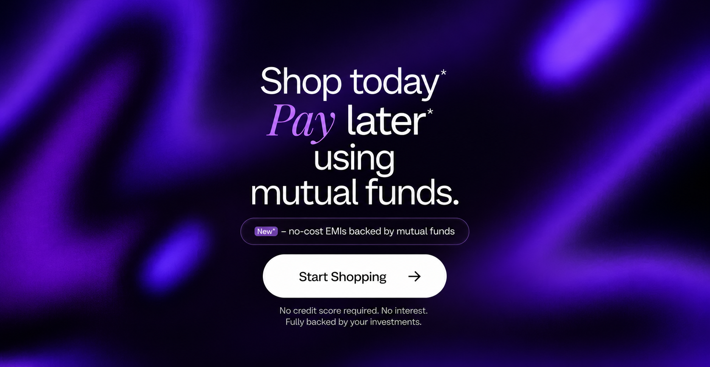

# 1Fi — Shop Now, Pay Later Using Your Mutual Funds



A full-stack "shop now, pay later" web app: browse products, pick a variant,
choose a **no-cost EMI** plan backed by your mutual funds, review the summary,
and proceed. All product, variant, and EMI data is served **live from a REST API
backed by MongoDB** — nothing is hardcoded in the frontend.

## Tech stack

| Layer     | Tech                                            |
| --------- | ----------------------------------------------- |
| Frontend  | React 18, React Router, Tailwind CSS, Vite      |
| Backend   | Node.js, Express                                |
| Database  | MongoDB via Mongoose                            |

> **Zero-setup database:** if no `MONGODB_URI` is provided, the backend boots an
> in-memory MongoDB automatically (via `mongodb-memory-server`) and seeds it, so
> the app runs on a fresh machine with no database install. Point `MONGODB_URI`
> at a real MongoDB (local or Atlas) to persist data.

## Project structure

```
.
├── backend/
│   ├── config/db.js              # DB connection (+ in-memory fallback)
│   ├── models/                   # Product, Variant, EmiPlan schemas
│   ├── controllers/              # Route handlers
│   ├── routes/products.js        # /api/products, /api/products/:slug
│   ├── seed/                     # Catalogue data + seeder
│   └── server.js                 # Express app entry
└── frontend/
    └── src/
        ├── pages/                # HomePage, ProductPage, NotFound
        ├── components/           # EmiCard, States
        └── lib/                  # api client, formatting
```

## Getting started

### 1. Install dependencies

```bash
npm run install:all
```

(or install per package: `npm install --prefix backend` and
`npm install --prefix frontend`)

### 2. Run both servers

One command (installs `concurrently` at the root first — `npm install`):

```bash
npm run dev
```

Or run them in two terminals:

```bash
npm run dev:backend   # API  → http://localhost:5000
npm run dev:frontend  # Web  → http://localhost:5173
```

Open **http://localhost:5173**.

## REST API

| Method | Endpoint               | Description                                        |
| ------ | ---------------------- | -------------------------------------------------- |
| GET    | `/api/products`        | List all products (for the listing page)           |
| GET    | `/api/products/:slug`  | One product with its variants + each variant's EMIs |
| GET    | `/api/health`          | Health check                                       |

Example product slugs: `iphone-17-pro`, `samsung-s24-ultra`, `google-pixel-9-pro`.

### `GET /api/products/:slug` response shape

```jsonc
{
  "_id": "...",
  "name": "iPhone 17 Pro",
  "slug": "iphone-17-pro",
  "image": "data:image/svg+xml;...",
  "mrp": 149900,
  "price": 139900,
  "variants": [
    {
      "_id": "...",
      "storage": "256GB",
      "color": "Natural Titanium",
      "mrp": 149900,
      "price": 139900,
      "emiPlans": [
        { "_id": "...", "monthlyAmount": 46633, "tenure": 3, "interestRate": 0, "cashback": 0 }
      ]
    }
  ]
}
```

## Data model

- **Product** — `name, slug, image, mrp, price, brand, description`
- **Variant** — `productId, storage, color, colorHex, mrp, price`
- **EmiPlan** — `variantId, monthlyAmount, tenure, interestRate, cashback`

EMI plans are computed per variant at seed time (no-cost EMIs use an even split;
interest-bearing plans use the reducing-balance EMI formula), then stored in the
database. The seed catalogue lives in [`backend/seed/seedData.js`](backend/seed/seedData.js).

## Deployment

Deployed as three free pieces — **MongoDB Atlas** (database), **Render** (API),
**Vercel** (frontend). Full click-by-click steps are in **[DEPLOY.md](DEPLOY.md)**.

- `render.yaml` — Render Blueprint for the API (set `MONGODB_URI` in the dashboard).
- `frontend/vercel.json` — Vercel config for the Vite SPA (set `VITE_API_BASE` to
  the deployed API URL).

```
Browser ──▶ Vercel (React) ──fetch──▶ Render (Express) ──▶ Atlas (MongoDB)
```

## Using a real MongoDB

```bash
# backend/.env
MONGODB_URI=mongodb://localhost:27017/emi
```

Then seed it once:

```bash
npm run seed
```

## User flow

Home → select product → product detail → select variant → select EMI plan →
review summary → **Proceed with EMI** (enabled only after a plan is chosen).
